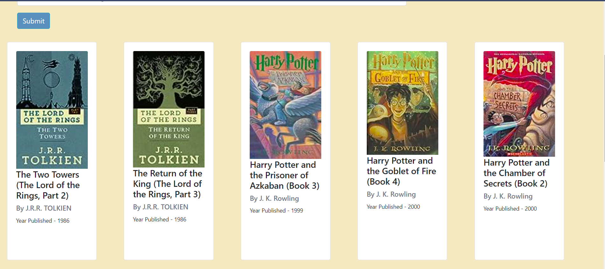

# SwiftReads Recommender

A book recommender which helps you start your reading journey again! Discover your next read from popular books or get recommendations


## Demo

[SwiftReads_demo.webm](https://github.com/NeeteshC7/SwiftReads_Recommender/assets/129514712/141e1a09-ce7e-4ab4-97ff-62f5c3acb107)

<br><br>

👉👉👉 [Live Application](https://swiftreads-recommender.onrender.com) deployed on [Render](https://render.com) 🌐 🚀

Feel free to play around and let us know what you think! If you encounter any issues or have suggestions, please open an [issue](https://github.com/NeeteshC7/SwiftReads_Recommender/issues) on GitHub.

<br><br>

### Screenshots

This is the home page


These are the fifty most poplar books


Enter a book name to get recommendations


Top ten recommendations based on search query




## Introduction

Welcome to SwiftReads: Rediscover the Joy of Reading! 📚

In a world buzzing with notifications and fast-paced living, finding time to dive into a good book can be a rare luxury. SwiftReads is here to change that! We understand that in the midst of busy schedules, the art of reading often takes a backseat. Fear not, fellow bookworms, for SwiftReads is your ticket to reclaiming that reading time and discovering new literary adventures.

Why SwiftReads? 🚀

These days, the clock seems to tick faster than ever, and the hours available for a good book dwindle. But fear not, because SwiftReads is your literary time-travel machine! Whether you're a seasoned reader looking for fresh recommendations or a newcomer eager to embark on a reading journey, we've got you covered.

A Dash of Tech Magic 🤖✨

Just like your favorite streaming platforms recommend movies and music, SwiftReads employs sophisticated recommendation algorithms inspired by the wizards of Amazon, Netflix, and Spotify. Our recommender system taps into the magic of machine learning to analyze your reading preferences and curate a personalized list of top-notch book recommendations just for you.

**Objective: Unveiling the Magic Behind SwiftReads** 🎩📖

To create a Book Recommendation System that not only understands your reading habits but predicts your next literary obsession with uncanny accuracy. 🚀📚


## Dataset Information
## Overview
The Book-Crossing dataset is a collection of data related to users, books, and ratings. It provides valuable insights into user behavior and preferences for book recommendations.

## Files

#### 1. Users
- Anonymized user IDs (User-ID) mapped to integers.
- Demographic data (Location, Age) when available.
- NULL-values in demographic fields for instances where data is unavailable.

#### 2. Books
- Books are identified by their ISBN.
- Invalid ISBNs have been removed.
- Content-based information includes Book-Title, Book-Author, Year-Of-Publication, and Publisher.
- For books with multiple authors, only the first author is provided.
- URLs linking to cover images in small, medium, and large sizes (Image-URL-S, Image-URL-M, Image-URL-L), sourced from Amazon Web Services.

#### 3. Ratings
- Contains book rating information.
- Ratings (Book-Rating) are either explicit on a scale from 1-10 (higher values indicating higher appreciation) or implicit, expressed by 0.

### Source
The dataset is sourced from Kaggle and can be found [here](https://www.kaggle.com/datasets/arashnic/book-recommendation-dataset).

## Approach

### Data Processing & EDA

The dataset, downloaded from Kaggle, underwent meticulous scrutiny for null values. Notably, the Books section exhibited some gaps, while the user age field was generously sprinkled with NULLs. For this model currently, I didn't use age of users.Since the data was clean barring some slight preprocessing, I used it directly.

**In Exploratory Data Analysis (EDA):**

- **Publication Insights 📚📆**
   - A dive into the temporal dimension reveals a spike in book publications in 2002.
    
   
  
- **Authorship Marvels 🖋️🌟**
   - Agatha Christie emerges as the literary juggernaut, boasting a staggering 600+ books. 👏
   - William Shakespeare secures the second spot, joined by luminaries like Stephen King and Jane Austen.

      

- **Publisher Prowess 🏭📖**
   - Harlequin Publishers stand tall, holding the record for the most books published. A nod to prolific storytelling! 📚

   

### Popularity based recommender 🌟

**My Approach 🚀**

For the Popularity-based Recommender, I employed the **Weighted Average Rating** approach, a reliable method in the realm of recommendation systems. This approach provides a nuanced view of the dataset, shedding light on popular book series—specifically, the Harry Potter series and Lord of the Rings.

**Why Popularity Matters Everywhere 🌐**

Popularity-based recommenders, widely used in platforms like Netflix, Amazon, Spotify and Goodreads, tap into collective preferences. They recommend items based on their broad appeal, making them a robust choice for various applications.

**The Outcome 📈📚**

The result? The Harry Potter series and Lord of the Rings emerged as the prominent favorites, resonating strongly with a broad audience. This methodology aligns with industry standards, offering a blend of simplicity and effectiveness in recommending items with mass appeal.


### Collaborative filtering based recommender

In developing the Collaborative Filtering-based Recommender, I leveraged the dynamic interplay of user, rating, and book data. This method revolves around constructing a 2D matrix.
To quantify relationships between books based on user ratings, the cosine similarity metric takes center stage. It calculates the cosine of the angle between vectors in this user-item matrix, unveiling the nuanced similarities in user preferences for different books.

Finally, predictions are done based on the name of the book provided.

### Workflow


## Running Locally with Docker 🐳

To run SwiftReads locally using Docker, follow these steps:

1. Clone the Repository:
   ```bash
   git clone https://github.com/NeeteshC7/SwiftReads_Recommender.git
   cd swiftreads
   ```
   
2. Build the Docker Image:

     ```bash
        docker build -t swiftreads-recommender:latest .
     ```
    This command will build a Docker image for the SwiftReads    
    Recommender.

3. Run the Docker Container:

    ```bash
        docker run -p 5000:5000 swiftreads-recommender:latest
    ```
This command will start the SwiftReads Recommender application inside a Docker container, and you can access it at http://localhost:5000 in your web browser.

## Challenges & Next Steps

### Challenges

One of the current challenges in the Popularity Recommender is the presence of repeated titles. Some books share alternate titles, resulting in duplication. The next steps involve addressing this issue to ensure a more accurate and streamlined recommendation experience.

### Next Steps

1. **Content-Based Recommender:**
   
Introduce a Content-Based Recommender to enhance the system's ability to suggest books based on their intrinsic features, providing a more personalized recommendation experience.

2. **Genre-Based Sorting for Popular Books:**

Implement a genre-based sorting mechanism for popular books. This enhancement will allow users to explore popular books within specific genres, catering to diverse preferences.

3. **Hybrid Recommender System:**

Develop a Hybrid Recommender System that combines the strengths of both collaborative filtering and content-based approaches. This integration aims to provide more robust and accurate recommendations, leveraging the strengths of different recommendation strategies.

These next steps aim to not only resolve current challenges but also to elevate the recommendation system's functionality and user experience.
